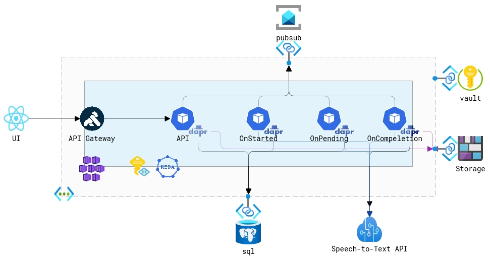

# Overview 
This is an application to demonstrates various Azure services. It will transcribe an audio podcast (up to 50mb in size) to text using Azure Cognitive Services. It uses the Saga pattern and to manage the transcription process.  It uses [Dapr](https://dapr.io) as the distributive runtime to manage communication between the various service components. [Dapr Virtual Actors](https://docs.dapr.io/developing-applications/building-blocks/actors/actors-overview/) are also leveraged. 

The application exposes both a REST API consumed by a React-based UI and a gRPC API consumed by a commandline application

## Components
Component | Usage
------ | ------
Azure Kubernetes Service | Container Orchestration Runtime Platform  
Azure Blob Storage | Podcast Storage 
Azure Cognitive Services | Service that does actual transcription 
Azure Service Bus | Pubsub
Azure Web PubSub | Real-time UI upates
Azure Static Web Apps | Hosting platform for React UI
Azure PosgreSQL | Backing store
Azure Key Vault | Secret store 
Kong | API Gateway 
Keda | Autoscaler for saga components 

# Architecture


# Deployment

[](https://codespaces.new/briandenicola/traduire?quickstart=1)
[](https://vscode.dev/redirect?url=vscode://ms-vscode-remote.remote-containers/cloneInVolume?url=https://github.com/briandenicola/traduire)  

## Prerequisites
* A Linux machine or Windows Subsytem for Linux or Docker for Windows 
* PowerShell 7 in Linux/WSL
* Azure Cli and an Azure Subscription
* Terraform 
* Kubectl
* Helm 3 
* Docker 
* Azure subscription with Owner access permissions
* [AKS Preview Features](https://github.com/briandenicola/kubernetes-cluster-setup/blob/main/scripts/aks-preview-features.sh)
    * Script requires `/usr/bin/watch` which is not part of the default bash shell on macos.
    * Run brew install `watch` on macos

## Infrastructure 
```pwsh
    cd ./scripts
    pwsh ./create_infrastructure.ps1 -Subscription BJD_AZ_SUB01 -Region southcentralus 
```

## Application Deployment 
```pwsh
    cd ./scripts
    pwsh ./deploy_services.ps1 -AppName $AppName -Subscription BJD_AZ_SUB01 -DomainName bjd.tech [-SkipBuild] [-BuildOnly] [-upgrade] -verbose
```
> **NOTE:** Update the DNS record of Uri to the IP Address returned by the script in the form of ${APP_NAME}.api.traduire.bjd.tech

## UI Deployment 
```pwsh
    cd ./scripts
    pwsh ./deploy_ui.ps1 -AppName $AppName -Subscription BJD_AZ_SUB01 -DomainName bjd.tech -Verbose
```
> **NOTE:** Create a CNAME record in the DNS to point to the Azure Static Web App in the form of ${APP_NAME}.traduire.bjd.tech

# Validate 

## Automated with Playwright
```bash
    cd ./scripts
    ./run-tests.sh traduire.bjd.tech #Or whatever your default Url from Azure Static Web Apps
```
> **NOTE:** Playwright will test the UI functionality and display the trace on completion. 
    

## Interactively
* Launch Browser
* Navigate to the URI outputed by the deploy_ui.ps1
* Select and upload any podcast.  
    * [The History of Rome Episode #1](http://traffic.libsyn.com/historyofrome/01-_In_the_Beginning.mp3) is a great example.
    * File size must be less than 50mb and limited to one speaker
* The UI will update the status every 30 seconds until the transcription is complete. 
    
    
* The transcriptions takes between 5 and 10 minutes to complete.
* Once the status has been updated to `Completed` then click the `Get Transcription` button
* Then the final result should be: 
    

# Backlog 
- [X] Add null_resource to bin Keda's identity to cluster
- [X] Test Cluster creation with new Terraform and Flux extension
- [X] Update Helm Chart - Service Accounts/Deployments 
- [X] Test applciation deployment
- [X] Validate application functionality
- [X] Update to Workload Identity
- [X] Update React UI to Next.js
- [X] Update to dotnet8 
- [X] Deployment Updates
- [ ] Swap Cognitive Services with OpenAI
